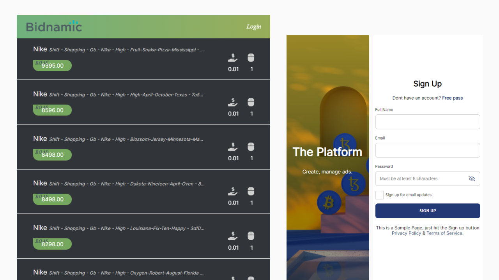

# Bidnamic API with HTML Template



## Summary
The Bidnamic API is a RESTful API that retrieves the Top 10 Search Terms by ROAS for a campaign `structure_value`. The HTML template displays the Top 10 Search Terms by ROAS by Nike's `structure_value`
> A valid token is required to access the endpoint.

## Requirements
* Python 3.8 or higher
* PostgreSQL 10.1 or higher

## Getting started


### Cloning repository

Clone the repository using:

```
git clone https://github.com/AugustineEbiem/bidnamic-fullstack-challenge.git
```

Once cloned, you can open the project folder:

``` 
cd bidnamic-fullstack-challenge
```


### Running the App

To get this project up and running it is advised you create a virtual environment.

In a terminal (mac/linux) or windows terminal, run the following command

```
python3 -m venv env
```

That will create a new folder `env` in your project directory. Next activate it with this command on mac/linux:

```
source env/bin/activate
```
`env\Scripts\activate` on windows

Then install the project dependencies with

```
pip install -r requirements.txt
```

Now you can run the project with this command

```
python manage.py runserver
```

## Backend workflow

The API endpoints:
```
http://localhost:8000/api/v1/structure_value/nike/1578411800/
```
```
http://localhost:8000/api/v1/structure_value/adidas/1578629887/
```
```
http://localhost:8000/api/v1/structure_value/nike/1578411797/
```
```
http://localhost:8000/api/v1/structure_value/puma/1578630235/
```
check server endpoint:
```
http://localhost:8000/api/v1/checkserver
```
## Frontend workflow
Home page:
```
http://localhost:8000
```
Sample Login page:
```
http://localhost:8000/login/
```